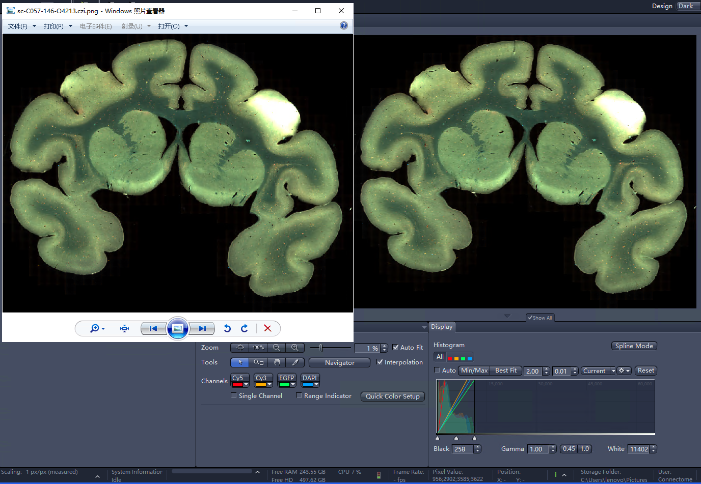

# CZI shader

[中文](./README_CN.md) [English](./README.md)

## 简介

本项目旨在以 Python 复现 Zeiss Zen 软件中所见 CZI 文件的观感 (为 raw 数据着色), 同时提供一个简单的 CZI 通道信息解析器. 

## 安装

```bash
pip install czi-shader
```

## 使用

### example 1: 

```python
import cv2
from czi_shader import CZIChannel, shading_czi

p = '/mnt/inner-data/sc-C057-146-O4213.czi'
[print(c) for c in CZIChannel.from_czi(p)]

res = shading_czi(p, scale_factor=0.01)
cv2.imwrite(p + '.png', cv2.cvtColor(res, cv2.COLOR_RGB2BGR))
```

output:

```python
CZIChannel(id=0, name='Cy5', bit_count_range=16, pixel_type='Gray16', dye_name='Cy5', short_name='Cy5', illumination_type='Fluorescence', dye_max_emission=673, dye_max_excitation=650, dye_id='McNamara-Boswell-0774', dye_database_id='66071726-cbd4-4c41-b371-0a6eee4ae9c5', color='#FFFF0014', original_color='#FFFF0014', color_mode=None, palette_name=None, gamma=None, low=0.0059662775616083005, high=0.03865110246433204, is_selected=None)
CZIChannel(id=1, name='Cy3', bit_count_range=16, pixel_type='Gray16', dye_name='Cy3', short_name='Cy3', illumination_type='Fluorescence', dye_max_emission=561, dye_max_excitation=548, dye_id='McNamara-Boswell-0615', dye_database_id='66071726-cbd4-4c41-b371-0a6eee4ae9c5', color='#FFFFAD00', original_color='#FFFFAD00', color_mode=None, palette_name=None, gamma=None, low=0.006240939955748837, high=0.13965056839856566, is_selected=None)
CZIChannel(id=2, name='EGFP', bit_count_range=16, pixel_type='Gray16', dye_name='EGFP', short_name='EGFP', illumination_type='Fluorescence', dye_max_emission=509, dye_max_excitation=488, dye_id='McNamara-Boswell-0828', dye_database_id='66071726-cbd4-4c41-b371-0a6eee4ae9c5', color='#FF00FF5B', original_color='#FF00FF5B', color_mode=None, palette_name=None, gamma=None, low=0.004196231021591516, high=0.1739833676661326, is_selected=None)
CZIChannel(id=3, name='DAPI', bit_count_range=16, pixel_type='Gray16', dye_name='DAPI', short_name='DAPI', illumination_type='Fluorescence', dye_max_emission=465, dye_max_excitation=353, dye_id='McNamara-Boswell-0434', dye_database_id='66071726-cbd4-4c41-b371-0a6eee4ae9c5', color='#FF00A0FF', original_color='#FF00A0FF', color_mode=None, palette_name=None, gamma=None, low=0.003936827649347677, high=0.15408560311284047, is_selected=None)
```

可以看到四种荧光(Cy5, Cy3, EGFP, DAPI)还有对应的波长、深度、展示色、展示上下限都在, 最终的合并图像对比如下: 



主色调与 Zen 中所展示相关, 其中些微不同来自于生成图使用了 0.01 缩放

### example 2:

获取镜头的物理分辨率: 

```python
from czi_shader import CZIMeta

p = '/data/sdf/sc-C057-146-O4213.czi'
meta = CZIMeta.from_czi(p)
print('resolution:', meta.resolution)

print('channels:')
for ch in meta.channels:
    print(ch)
```

output:

```python
resolution: CZIPhysicalResolution(x=<Quantity(6.5e-07, 'micrometer / pixel')>, y=<Quantity(6.5e-07, 'micrometer / pixel')>)
channels:
CZIChannel(id=0, name='Cy5', bit_count_range=16, pixel_type='Gray16', dye_name='Cy5', short_name='Cy5', illumination_type='Fluorescence', dye_max_emission=673, dye_max_excitation=650, dye_id='McNamara-Boswell-0774', dye_database_id='66071726-cbd4-4c41-b371-0a6eee4ae9c5', color='#FFFF0014', original_color='#FFFF0014', color_mode=None, palette_name=None, gamma=None, low=0.0059662775616083005, high=0.03865110246433204, is_selected=None)
CZIChannel(id=1, name='Cy3', bit_count_range=16, pixel_type='Gray16', dye_name='Cy3', short_name='Cy3', illumination_type='Fluorescence', dye_max_emission=561, dye_max_excitation=548, dye_id='McNamara-Boswell-0615', dye_database_id='66071726-cbd4-4c41-b371-0a6eee4ae9c5', color='#FFFFAD00', original_color='#FFFFAD00', color_mode=None, palette_name=None, gamma=None, low=0.006240939955748837, high=0.13965056839856566, is_selected=None)
CZIChannel(id=2, name='EGFP', bit_count_range=16, pixel_type='Gray16', dye_name='EGFP', short_name='EGFP', illumination_type='Fluorescence', dye_max_emission=509, dye_max_excitation=488, dye_id='McNamara-Boswell-0828', dye_database_id='66071726-cbd4-4c41-b371-0a6eee4ae9c5', color='#FF00FF5B', original_color='#FF00FF5B', color_mode=None, palette_name=None, gamma=None, low=0.004196231021591516, high=0.1739833676661326, is_selected=None)
CZIChannel(id=3, name='DAPI', bit_count_range=16, pixel_type='Gray16', dye_name='DAPI', short_name='DAPI', illumination_type='Fluorescence', dye_max_emission=465, dye_max_excitation=353, dye_id='McNamara-Boswell-0434', dye_database_id='66071726-cbd4-4c41-b371-0a6eee4ae9c5', color='#FF00A0FF', original_color='#FF00A0FF', color_mode=None, palette_name=None, gamma=None, low=0.003936827649347677, high=0.15408560311284047, is_selected=None)
```
